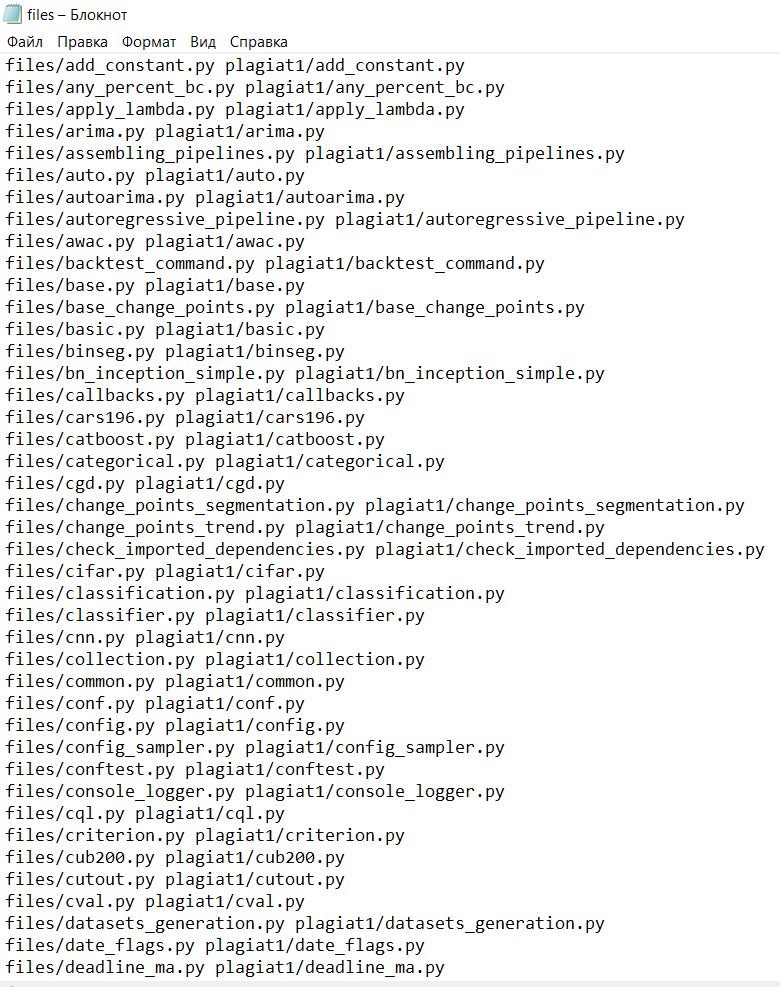

# Над проектом работали
@YouNotKissMe  
@DarkOugi  
Один и тот же человек, но с разных устройств

# Задча для Machine Learning Весна'23
Антиплагиат  
Для решения был использован алгоритм расстояния Левенштейна
## Какие файлы за что отвечают ?

### dist_lev.py - фаил с алгоритмом расчета метрики - расстояние Левинштейна
Сейчас работает с динамически меняющейся матрицей, из-за этого количество 
требуемой памяти уменьшилось с MxN, где M,N - длина первого и второго слова, до N, 
так как создается матрица размером 2xN  
Но сложность алгоритма квадратичная, поэтому обработка больших файлов занимает много времени

### compare.py - файл интерфейса.
Пример использования программы:  
Проверялось на операционной системе Windows, через командную строку cmd  
  
Пример данных в input.txt  
  
Пример выходных данных scores.txt  
 

Метрика расчета процента схожести двух файлов - 
metric_lev = (origin_file_size - lev_dist)/(origin_file_size)
### files_with_dir.py - добавляет в указанный фаил все файлы в указанных 2 директориях 
Пример использования:    
  
Получившийся файл  

